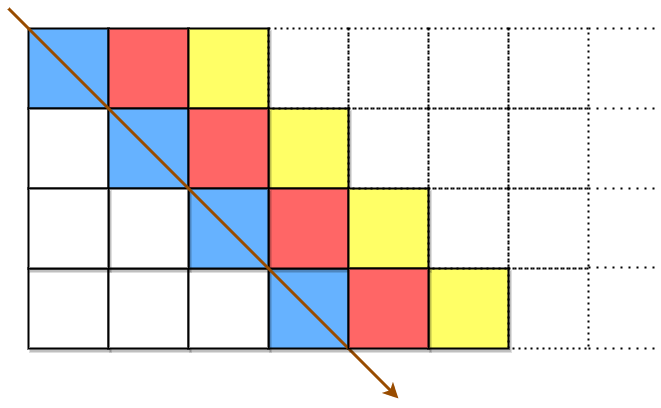
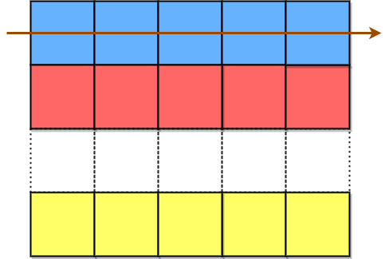

# Classical Ciphers
The main classical cipher types are [transposition ciphers](https://en.wikipedia.org/wiki/Transposition_cipher), which rearrange the order of letters in a message (e.g., 'hello world' becomes 'ehlol owrdl' in a trivially simple rearrangement scheme), and [substitution ciphers](https://en.wikipedia.org/wiki/Substitution_cipher), which systematically replace letters or groups of letters with other letters or groups of letters (e.g., 'fly at once' becomes 'gmz bu podf' by replacing each letter with the one following it in the Latin alphabet).

Many classical ciphers are vulnerable to [frequency analysis](https://en.wikipedia.org/wiki/Frequency_analysis).

## Substitution Ciphers
A substitution cipher changes one character into another.

### [Atbash](https://en.wikipedia.org/wiki/Atbash)
The alphabet is mapped to its reverse, so an "A" becomes a "Z", "B" turns into "Y", etc.

#### Examples

| Plaintext | Ciphertext |
| -------------------------- | -------------------------- |
| May the Force be with you. | Nzb gsv Ulixv yv drgs blf. |
| tomorrow is another day    |  glnliild rh zmlgsvi wzb   |

#### Implementation

```python
def encrypt(msg: str) -> str:
    return "".join(_translate(s) if is_english_letter(s) else s for s in msg)

def decrypt(msg: str) -> str:
    return encrypt(msg)

def _translate(s: str) -> str:
    if s.isupper():
        return chr(ord("A") + ord("Z") - ord(s))
    else:
        return chr(ord("a") + ord("z") - ord(s))
```

Below is a utility function that checks if a letter is an English letter.

```python
def is_english_letter(s: str) -> bool:
    return s.isascii() and s.isalpha()
```

Notes:

* Non-Latin letters are kept as-is.
* `_translate(s)` preserves the case of `s`.

### [Caesar](https://en.wikipedia.org/wiki/Caesar_cipher)
Each letter in the plaintext is replaced by a letter some fixed number of positions down the alphabet. For example, with a right shift of 3, A would be replaced by D, B would become E, and so on.

#### Examples

| Plaintext | shift | Ciphertext |
| -------------------------- | --- | ----------------------- |
| May the Force be with you. |  1  | Nbz uif Gpsdf cf xjui zpv. |
| tomorrow is another day    |  3  | wrpruurz lv dqrwkhu gdb |

#### Implementation

```python
def encrypt(msg: str, k: int) -> str:
    return "".join(right_shift(s, k) if is_english_letter(s) else s for s in msg)

def decrypt(msg: str, k: int) -> str:
    return "".join(right_shift(s, -k) if is_english_letter(s) else s for s in msg)
```

Below is a utility function that does the right shift. Supply `right_shift()` with `-k` to make `k` shifts to the left.

```python
def right_shift(s: str, shift: int) -> str:
    start = "A" if s.isupper() else "a"
    plain_code = ord(s) - ord(start)
    cipher_code = (plain_code + shift) % 26
    return chr(ord(start) + cipher_code)
```

#### Cryptanalysis
A brute force attack can easily break Caesar cipher since there are only a limited number of possible shifts.

### [Affine](https://en.wikipedia.org/wiki/Affine_cipher)
A key consists of two numbers $m$ and $b$, where $m$ is coprime to the length of the alphabet. Then to get the ciphertext for the letter with character code $x$, we compute $mx + b$ and reduce modulo the length of the alphabet.

To decrypt, we just reverse the process: for each character of the ciphertext, subtract `b` and then multiply by the [modular multiplicative inverse](https://en.wikipedia.org/wiki/Modular_multiplicative_inverse) of $m$ modulo the length of the alphabet.

The Caesar cipher is an Affine cipher with $m = 1$. The Atbash cipher is an Affine cipher with $m = b = 25$.

#### Examples

| Plaintext | m | b | Ciphertext |
| -------------------------- | --- | ---| ----------------------- |
| May the Force be with you. |  1  |  1 | Nbz uif Gpsdf cf xjui zpv. |
| tomorrow is another day    |  25 | 25 | glnliild rh zmlgsvi wzb   |
| May the Force be with you. |  3  |  4 | Oey jzq Tudkq hq scjz yum. |
| tomorrow is another day    |  15 |  6 | fieibbiy wq gtifhob zgc |

#### Implementation

```python
from math import gcd

def encrypt(msg: str, m: int, b: int) -> str:
    if gcd(m, 26) != 1:
        raise ValueError(f"{m} and 26 are not relatively prime")
    return "".join(_encrypt(s, m, b) if is_english_letter(s) else s for s in msg)

def decrypt(msg: str, m: int, b: int) -> str:
    if gcd(m, 26) != 1:
        raise ValueError(f"{m} and 26 are not relatively prime")
    return "".join(_decrypt(s, m, b) if is_english_letter(s) else s for s in msg)

def _encrypt(s: str, m: int, b: int) -> str:
    start = "A" if s.isupper() else "a"
    plain_code = ord(s) - ord(start)
    cipher_code = (m * plain_code + b) % 26
    return chr(ord(start) + cipher_code)

def _decrypt(s: str, m: int, b: int) -> str:
    start = "A" if s.isupper() else "a"
    plain_code = ord(s) - ord(start)
    cipher_code = ((plain_code - b) * pow(m, -1, 26)) % 26
    return chr(ord(start) + cipher_code)
```

Note: `pow(m, -1, 26)` computes the modular multiplicative inverse of `m` modulo 26.

The `gcd` isn't hard to implement ourselves. The function below uses [Euclidean algorithm](https://en.wikipedia.org/wiki/Euclidean_algorithm) and has $O(\log(\min(a, b)))$ time complexity.

```python
def gcd(a: int, b: int) -> int:
    if b == 0:
        return abs(a)
    return gcd(b, a % b)
```

#### Cryptanalysis
If you know a message is encrypted with an affine cipher, you only need to determine what two letters are to crack the encryption by solving a simultaneous equation.

### [Vigenère](https://en.wikipedia.org/wiki/Vigen%C3%A8re_cipher)
In the Vigenère Cipher, we choose a word or phrase as our encryption key. We then convert it to a sequence of numbers (using `a=0, b=1, ..., z=25`), and apply a different shift to the plaintext corresponding to the letters in the keyword. When we use up the shifts from the keyword, we repeat it again.

#### Examples

| Plaintext | key | Ciphertext |
| -------------------------- | --- | ----------------------- |
| May the Force be with you. |  world  | Iop eka Tfcfa pv hlpv pzx. |
| tomorrow is another day    |  cat  | vofqrkqw bu agqtagr wcy |

#### Implementation
```python
def encrypt(msg: str, key: str) -> str:
    key_to_ints = str_to_ints(key)
    i = 0
    encrypted = []
    for s in msg:
        if is_english_letter(s):
            encrypted.append(right_shift(s, key_to_ints[i]))
            i = (i + 1) % len(key_to_ints)
        else:
            encrypted.append(s)
    return "".join(encrypted)


def decrypt(msg: str, key: str) -> str:
    key_to_ints = str_to_ints(key)
    i = 0
    decrypted = []
    for s in msg:
        if is_english_letter(s):
            decrypted.append(right_shift(s, -key_to_ints[i]))
            i = (i + 1) % len(key_to_ints)
        else:
            decrypted.append(s)
    return "".join(decrypted)
```

The encryption key is converted to a list of integers by first converting it to lower case and then ignoring non-English characters.

```python
def str_to_ints(s: str) -> list[int]:
    return [ord(char) - ord("a") for char in s.lower() if is_english_letter(char)]
```

#### Cryptanalysis

The primary weakness of the Vigenère cipher is the repeating nature of its key. If a cryptanalyst correctly guesses the key's length $n$, the cipher text can be treated as $n$ interleaved Caesar ciphers, which can easily be broken individually.

### [One-time Pad](https://en.wikipedia.org/wiki/One-time_pad)
A plaintext is paired with a random secret key (also referred to as a one-time pad). The pad must not be shorter than the plaintext. Then, each character of the plaintext is combined with the corresponding character from the pad using modular addition.

#### Examples

| Plaintext | pad | Ciphertext |
| -------------------------- | --- | ----------------------- |
| May the Force be with you. |  NbzuifGpsdfcfxjuizpstapq  | Zbx npj Ldjfj dj trnp xdm. |
| tomorrow is another day    |  upnpsspxjtbopuifsebz  | ndzdjjdt rl bbdnpjj hbx |
|Why so serious|yhphsvmvuous|Uon zg nqmccok|

#### Implementation
```python
def encrypt(msg: str, pad: str) -> str:
    key_to_ints = str_to_ints(pad)
    i = 0
    encrypted = []
    for s in msg:
        if is_english_letter(s):
            if i == len(key_to_ints):
                raise ValueError("pad is too short")
            encrypted.append(right_shift(s, key_to_ints[i]))
            i += 1
        else:
            encrypted.append(s)
    return "".join(encrypted)


def decrypt(msg: str, pad: str) -> str:
    key_to_ints = str_to_ints(pad)
    i = 0
    decrypted = []
    for s in msg:
        if is_english_letter(s):
            if i == len(key_to_ints):
                raise ValueError("pad is too short")
            decrypted.append(right_shift(s, -key_to_ints[i]))
            i += 1
        else:
            decrypted.append(s)
    return "".join(decrypted)
```

#### Cryptanalysis

The security of the system stems from the fact that any plaintext can encrypt to any ciphertext of the same length. It's critical that the random numbers are truly random and cannot be [pseudorandom](https://en.wikipedia.org/wiki/Pseudorandomness).

## Transposition Ciphers
A transposition cipher reorders the plaintext. One of the key benefits of a transposition cipher over a substitution cipher such as an affine cipher is that a transposition cipher can be applied more than once.

### [Columnar transposition](https://en.wikipedia.org/wiki/Transposition_cipher#Columnar_transposition)
In a columnar transposition, the message is written out in rows of a fixed length, and then read out again column by column, and the columns are rearranged. Both the width of the rows and the permutation of the columns are defined by a keyword.

#### Examples

| Plaintext | key | Ciphertext |
| -------------------------- | --- | ----------------------- |
| May the Force be with you. |  zephyr  | a  t. oe yFbhhcwotr yMeeiu |
| tomorrow is another day    |  AMPLE  | trstdrio o nroo hamwaey |
| What we've got here is failure to communicate. | DIVERT | Weoea matehsu n.h't itmt  e rciwgrfeocav iloue |

#### Implementation

```python
def encrypt(msg: str, key: str) -> str:
    key = "".join(k.upper() for k in key if is_english_letter(k))
    if len(key) < 2 or len(key) >= len(msg):
        raise ValueError(f"key length must be in [2, {len(msg)}]")
    rows = []
    for s in msg:
        if not rows or len(rows[-1]) == len(key):
            rows.append([])
        rows[-1].append(s)
    columns = [[] for _ in key]
    for i in range(len(key)):
        for row in rows:
            if i < len(row):
                columns[i].append(row[i])
    return "".join("".join(col) for _, col in sorted(zip(key, columns)))

def decrypt(msg: str, key: str) -> str:
    key = "".join(k.upper() for k in key if is_english_letter(k))
    if len(key) < 2 or len(key) >= len(msg):
        raise ValueError(f"key length must be in [2, {len(msg)}]")
    k, r = divmod(len(msg), len(key))
    columns = [[] for _ in range(len(key))]
    idx = 0
    for _, i in sorted((k, i) for i, k in enumerate(key)):
        size = k + 1 if i < r else k
        for _ in range(size):
            columns[i].append(msg[idx])
            idx += 1
    decrypted = []
    for i in range(k + (r > 0)):
        for j in range(len(key)):
            if i < len(columns[j]):
                decrypted.append(columns[j][i])
    return "".join(decrypted)
```

#### Cryptanalysis

For short permutations (up to 6 letters), a brute-force algorithm can test all permutations.

Otherwise, by knowing a word of the plain text (if possible with unusual letters), it is possible to find the position of its letters and to deduce the compatible columns permutations.

To make it stronger, a [double transposition](https://en.wikipedia.org/wiki/Transposition_cipher#Double_transposition) was often used. This is simply a columnar transposition applied twice. The same key can be used for both transpositions, or two different keys can be used.

### [Rail fence](https://en.wikipedia.org/wiki/Rail_fence_cipher)
In the rail fence cipher, the plaintext is written downwards diagonally on successive "rails" of an imaginary fence, then moving up when the bottom rail is reached, down again when the top rail is reached, and so on until the whole plaintext is written out. The ciphertext is then read off in rows.

#### Examples

| Plaintext | rails | Ciphertext |
| -------------------------- | --- | ----------------------- |
| May the Force be with you. |  3  | MtFe hua h oc ewt o.yerbiy |
| tomorrow is another day    |  4  | toarorw ne mr sohdyoita |
| What we've got here is failure to communicate. |5|Wveaoih'ehrfit ncae  e l cuatwgt sueomt. oirme|

#### Implementation
```python
from itertools import accumulate

def encrypt(msg: str, rails: int) -> str:
    if rails < 2:
        raise ValueError(f"rails must be at least 2: {rails}")
    rows = [[] for _ in range(rails)]
    i = 0
    cycle = 2 * rails - 2
    for s in msg:
        row = cycle - i if i >= rails - 1 else i
        rows[row].append(s)
        i = (i + 1) % cycle
    return "".join("".join(row) for row in rows)

def decrypt(msg: str, rails: int) -> str:
    if rails < 2:
        raise ValueError(f"rails must be at least 2: {rails}")
    cycle = 2 * rails - 2
    k, r = divmod(len(msg), cycle)
    sizes = [k] + [2 * k] * (rails - 2) + [k]
    for i in range(r):
        row = cycle - i if i >= rails - 1 else i
        sizes[row] += 1

    row_indices = list(accumulate(sizes, initial=0))
    row_indices.pop()

    used = [0] * rails
    decrypted = []
    for _ in range(k + (r > 0)):
        for i in range(cycle):
            row = cycle - i if i >= rails - 1 else i
            char_idx = row_indices[row]
            if used[row] >= sizes[row]:
                break
            used[row] += 1
            row_indices[row] += 1
            decrypted.append(msg[char_idx])
    return "".join(decrypted)
```

#### Cryptanalysis
Rail fence can be cracked by testing each `rails` from 2 to $L - 1$ where $L$ is the length of the plaintext.

### [Route](https://en.wikipedia.org/wiki/Transposition_cipher#Route_cipher)
Route transposition uses a square or rectangular grid to disarrange a text.
The text is written into the grid by one route, and taken out of the grid by
another route.

#### Diagonal pattern

plaintext is placed first in a top-left to bottom-right manner:



The blue cells are filled first, followed by the red cells, then the yellow cells, and so on, until we reach the end of plaintext. The arrow indicates the order in which the cells are filled. All empty cells are filled with `' '`.

The number of columns is chosen such that the rightmost column will not be empty after filling in plaintext.

ciphertext is then formed by appending all characters of the matrix in a row-wise fashion.



The characters in the blue cells are appended first to encodedText, then the red cells, and so on, and finally the yellow cells. The arrow indicates the order in which the cells are accessed.

Note that even if the number of rows is fixed, there may be multiple ways to encrypt a plaintext, depending on the number of columns. For example, if `plaintext = "atallcost"`, and `rows = 3`, then ciphertext is `alot tls  ac` if we use 4 columns whereas ciphertext is `alo   tls   act` if we use 5 columns. The examples and implementation below uses the fewest columns so that the ciphertext is as short as possible.

##### Examples
| Plaintext | rows | Ciphertext |
| -------------------------- | --- | ----------------------- |
| attack tonight |  3  | aa nh  tctit  tkog |
| tomorrow is another day    |  5  |  trst y  oo hd   mwaea   o nr    rio |
| What we've got here is failure to communicate. | 6 | Weoea mc!   h't itma    av ilout    tehsu ne      e rci     wgrfeo |

##### Implementation

```python
from math import ceil
from typing import Iterator

def encrypt(msg: str, rows: int) -> str:
    cols = find_width(len(msg), rows)
    matrix = [[" " for _ in range(cols)] for _ in range(rows)]
    i = 0
    for r, c in diagonal_traversal(rows, cols):
        if i < len(msg):
            matrix[r][c] = msg[i]
            i += 1
        else:
            break
    return "".join("".join(row) for row in matrix)

def decrypt(msg: str, rows: int) -> str:
    cols = len(msg) // rows
    matrix = [[" " for _ in range(cols)] for _ in range(rows)]
    for i, s in enumerate(msg):
        r, c = divmod(i, cols)
        matrix[r][c] = s
    decrypted = []
    for r, c in diagonal_traversal(rows, cols):
        decrypted.append(matrix[r][c])
    return "".join(decrypted).rstrip()

def find_width(size: int, rows: int) -> int:
    return max(rows, ceil((size + rows * (rows - 1) // 2) / rows))

def diagonal_traversal(rows: int, cols: int) -> Iterator[tuple[int, int]]:
    for diff in range(cols):
        for j in range(min(rows, cols - diff)):
            yield (j, j + diff)
```

#### Spiral pattern

The examples and implementation below assumes the route to be "spiral inwards, clockwise, starting from the top left".

##### Examples

| Plaintext | width | Ciphertext |
| -------------------------- | --- | ----------------------- |
| May the Force be with you. |  4  |  May  ceto.uh eFtherbiy w o |
| tomorrow is another day    |  5  |  tomorio yadtsrow nreh a |
| What we've got here is failure to communicate. | 6 | What wgrfeoc.etam aeoe've e rcinumti t hsu oli |

##### Implementation

```python
from math import ceil
from typing import Iterator

def encrypt(msg: str, width: int) -> str:
    rows = ceil(len(msg) / width)
    matrix = [["" for _ in range(width)] for _ in range(rows)]
    for i, char in enumerate(msg):
        r, c = divmod(i, width)
        matrix[r][c] = char
    return "".join(matrix[r][c] for r, c in clockwise_traversal(rows, width))

def decrypt(msg: str, width: int) -> str:
    full_rows, remainder = divmod(len(msg), width)
    rows = full_rows + (remainder > 0)
    res = [["" for _ in range(width)] for _ in range(rows)]
    i = 0
    for (r, c) in clockwise_traversal(rows, width):
        if r < rows - 1 or c < remainder:
            res[r][c] = msg[i]
            i += 1
    return "".join("".join(row) for row in res)

def clockwise_traversal(rows: int, cols: int) -> Iterator[tuple[int, int]]:
    for k in range((min(rows, cols) + 1) // 2):
        for j in range(k, cols - k):
            yield (k, j)
        for i in range(k + 1, rows - k):
            yield (i, cols - k - 1)
        if rows - k - 1 != k and cols - k - 1 != k:
            for j in range(cols - k - 2, k, -1):
                yield (rows - k - 1, j)
            for i in range(rows - k - 1, k, -1):
                yield (i, k)
```

#### Cryptanalysis

Route ciphers have many more keys than a rail fence. The number of possible keys is potentially too great to be enumerated even by modern machinery for messages of reasonable length. Badly chosen routes, however, will leave excessive chunks of plaintext, or text simply reversed, and this will give cryptanalysts a clue as to the routes.

[](https://ko-fi.com/T6T416OJAV)