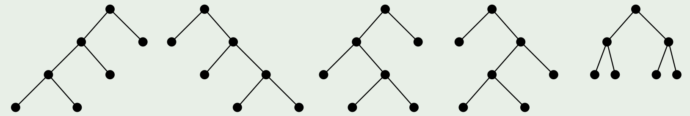
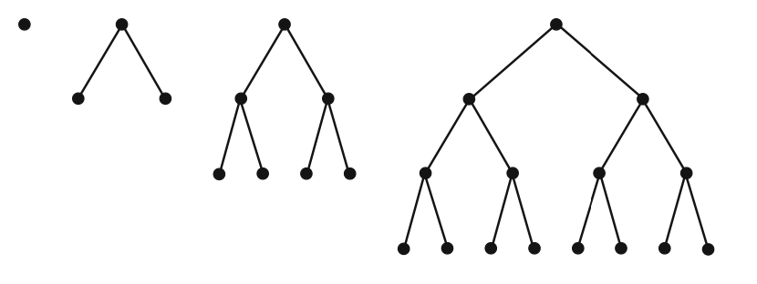
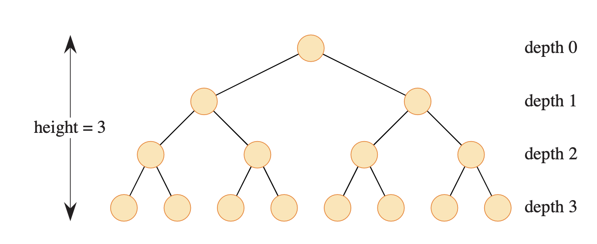
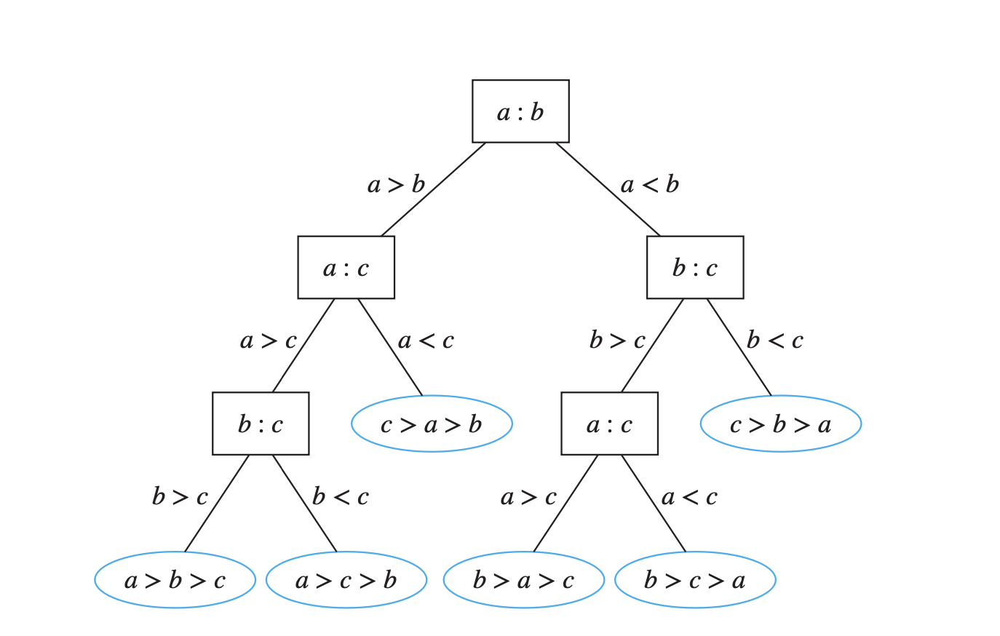
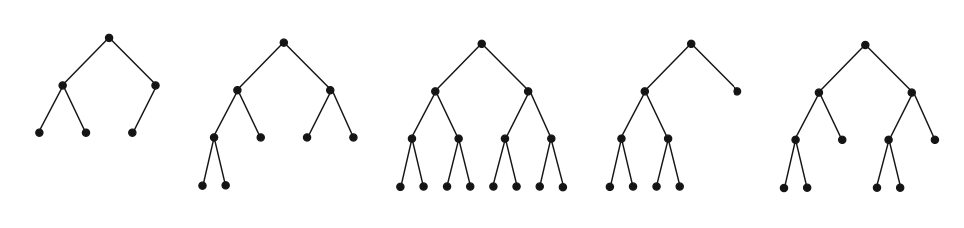

A [**$k$-ary tree**](https://en.wikipedia.org/wiki/M-ary_tree) is a [rooted tree](rooted_tree.md) in which each node has no more than $k$ children.

A [binary tree](https://en.wikipedia.org/wiki/Binary_tree) is the special case where $k = 2$.

The class below defines a `BinaryTreeNode`:

```python
class BinaryTreeNode:
    def __init__(self, val, left=None, right=None):
        self.val = val
        self.left = left
        self.right = right
```

### Types of k-ary Trees

#### Balanced k-ary tree

A tree of height $h$ is balanced if all leaves are at levels $h$ or $h − 1$.

The function below checks if a binary tree is balanced.

```python
def is_balanced(root: BinaryTreeNode) -> bool:
    return _is_balanced_height(root)[0]

def _is_balanced_height(root: BinaryTreeNode) -> tuple[bool, int]:
    if root is None:
        return True, -1
    left_balanced, left_height = _is_balanced_height(root.left)
    if left_balanced:
        right_balanced, right_height = _is_balanced_height(root.right)
        if right_balanced:
            return (
                abs(left_height - right_height) <= 1,
                max(left_height, right_height) + 1,
            )
    return False, 0
```

#### Full k-ary tree

A full $k$-ary tree is a $k$-ary tree where each internal node has exactly $k$ children.

_Theorem_: A full $k$-ary tree with $m$ internal nodes has $km+1$ nodes in total.

##### Count ordered full binary trees

There are five ordered full binary trees with 7 nodes:



The functions below counts the number of ordered full binary trees with $n$ nodes.

```python
from functools import lru_cache

@lru_cache(None)
def full_binary_trees(n: int) -> int:
    if n % 2 == 0:
        return 0
    if n == 1:
        return 1
    return sum(
        full_binary_trees(left) * full_binary_trees(n - 1 - left)
        for left in range(1, n, 2)
    )
```

The results are [Catalan numbers](https://en.wikipedia.org/wiki/Catalan_number).

#### Perfect k-ary tree

A perfect tree is a full tree in which all leaf nodes are at the same depth.


A perfect $k$-ary tree of height $h$ has

\[
1 + k + k^2 + \cdots + k^{h} = \frac{k^{h+1} - 1}{k-1}
\]

nodes.

Therefore, a perfect binary tree has $2^{h+1} - 1$ nodes.


The following code calculates the size of a perfect binary tree.

```python
def perfect_tree_size(root: BinaryTreeNode) -> int:
    if root is None:
        return 0
    h = _height(root)
    return _perfect_tree_size(h)

def _height(root: BinaryTreeNode) -> int:
    return -1 if root is None else 1 + _height(root.left)

def _perfect_tree_size(height: int) -> int:
    return 2 ** (height + 1) - 1
```

##### The Complexity of Comparison-based Sorting Algorithms
A rooted tree in which each internal vertex corresponds to a decision, with a subtree at these vertices for each possible outcome of the decision, is called a **decision tree**.

We can use decision trees to model sorting algorithms and to determine an estimate for the worst-case complexity of these algorithms. Note that given n elements, there are $n!$ possible orderings of these elements, because each of the n! permutations of these elements can be the correct order. A sorting algorithm based on binary comparisons can be represented by a binary decision tree in which each internal vertex represents a comparison of two elements. Each leaf represents one of the n! permutations of $n$ elements.



The complexity of a sort based on binary comparisons is measured in terms of the number of such comparisons used. The largest number of comparisons ever needed is equal to the height of the decision tree. Because the height of a binary tree with $n!$ leaves is at least $\lceil \log_2 n! \rceil$, at least $\lceil \log_2 n! \rceil$ comparison are needed.

#### Complete k-ary tree

A complete $k$-ary tree is completely filled on every level except for the last level. If the last level is not complete, then all nodes in the last level are as far left as possible.

Notes

* A complete tree is _not_ necessarily a full tree.
* A perfect tree is always complete.
* A complete tree is not necessarily perfect.

Question: Which of the following binary trees are complete?



The function below checks if a binary tree is complete:

```python
from collections import deque

def is_complete_tree(root: BinaryTreeNode) -> bool:
    q = deque([root])
    while q:
        node = q.popleft()
        if node is None:
            break
        q.append(node.left)
        q.append(node.right)
    return not any(q)
```

The function below counts the size of a complete binary tree:

```python
def complete_tree_size(root: BinaryTreeNode) -> int:
    if root is None:
        return 0
    lh = _height(root.left)
    rh = _height(root.right)
    if lh == rh:
        return 1 + _perfect_tree_size(lh) + complete_tree_size(root.right)
    else:
        return 1 + _perfect_tree_size(rh) + complete_tree_size(root.left)
```

##### Space Efficiency

Binary trees can be stored in breadth-first order as an implicit data structure in arrays, and if the tree is a complete binary tree, this method wastes no space. With a 1-indexed array, a node at index $i$ has its children at $2i$ and $2i+1$, and its parent is at $\lfloor i/2 \rfloor$. This method benefits from more compact storage and better locality of reference, particularly during a preorder traversal. This method of storage is often used for [binary heaps](https://en.wikipedia.org/wiki/Binary_heap).

###### Example: Complete Binary Tree Inserter

We implement a `CompleteBinaryTreeInserter ` class which supports inserting new values while maintainining the complete binary tree structure.

```python
from collections import deque

class CompleteBinaryTreeInserter:
    def __init__(self, root: BinaryTreeNode):
        self.nodes = [BinaryTreeNode(None)]
        q = deque([root])
        while q:
            node = q.popleft()
            self.nodes.append(node)
            if node.left:
                q.append(node.left)
            if node.right:
                q.append(node.right)

    def insert(self, v: int) -> None:
        node = BinaryTreeNode(v)
        parent = self.nodes[len(self.nodes) // 2]
        if len(self.nodes) % 2:
            parent.right = node
        else:
            parent.left = node
        self.nodes.append(node)

    def get_root(self) -> BinaryTreeNode:
        return self.nodes[1]
```

[](https://ko-fi.com/T6T416OJAV)