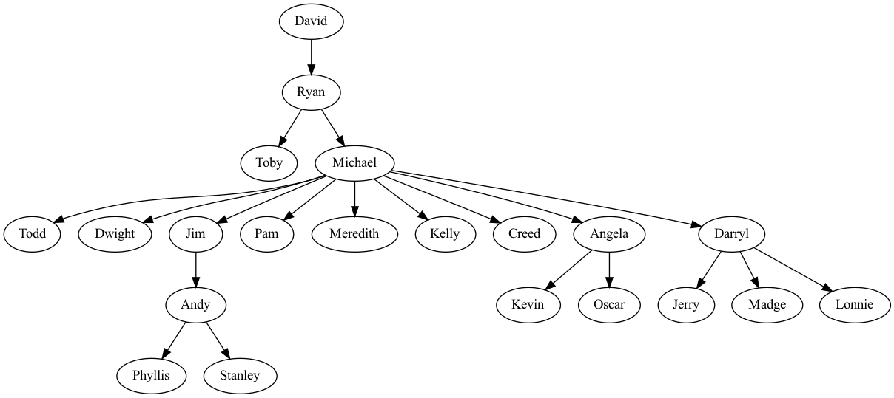
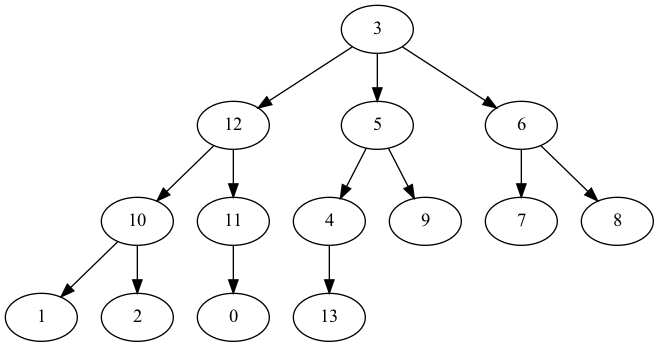
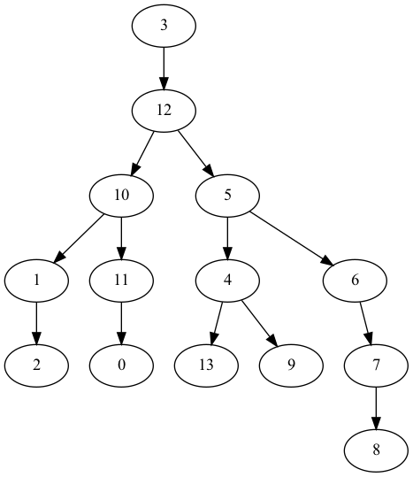
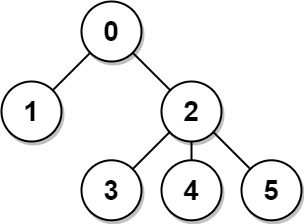
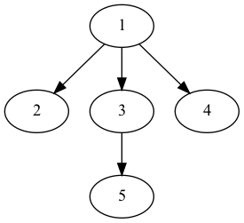
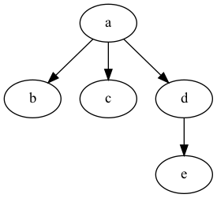
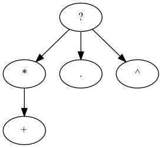

In a [**rooted tree**](https://en.wikipedia.org/wiki/Tree_(graph_theory)#Rooted_tree), one of its vertices is designated as the root. The root provides the tree with an orientation from **parent** to **child**. A node with no child is called a **leaf**. A node that's not a leaf is called an **internal** node.


An [**ordered tree**](https://en.wikipedia.org/wiki/Tree_(graph_theory)#Ordered_tree) is a rooted tree in which the children of each node are ordered. That is, if a node has children, then there is a first child, a second child, and so on.

### Representations

A rooted tree can be represented in various ways. In this section, we discuss three of them: [adjacency list](https://en.wikipedia.org/wiki/Adjacency_list), array-of-parents, and [first-child, next-sibling](https://en.wikipedia.org/wiki/Left-child_right-sibling_binary_tree).

The **adjacency list** representation of a tree $T$ is an array $C$ where $C[v]$ is the children of $v$, for all nodes in $T$.

The **array-of-parents** representation of a tree $T$ is an array $P$ where $P[v]$ is the parent of $v$ if $v$ is not the root of T, and `P[v] = None` otherwise, for all nodes in $T$.

The **first-child next-sibling** representation of a tree $T$ is a pair $(F, N)$ of arrays where:

* $F[v]$ is the first child of $v$ if $v$ is not a leaf node, and `F[v] = None` otherwise
* $N[v]$ is the next sibiling of $v$ if $v$ is not a last child node, `N[v] = None` otherwise

for all nodes in $T$.

Based on the context, one or the other of the representations will be best suited. Translating between the representations can be done in linear time.

#### Examples

Let's consider the following rooted tree.



The adjacency list representation of the above tree is

| `i`    | `0` | `1` | `2` | `3` | `4` | `5` | `6` | `7` | `8` | `9` | `10` | `11` | `12` | `13` |
| -----  | --- | --- | --- | --- | --- | --- | --- | --- | --- | --- | --- | --- | --- | --- |
| `C[i]` |`[]` |`[]` |`[]` |`[12,5,6]` |`[13]` |`[4,9]` |`[7,8]` |`[]` |`[]` |`[]` |`[1,2]` |`[0]` |`[10,11]` |`[]` |

The array-of-parents representation of the same tree is:

| `i`    | `0` | `1` | `2` | `3` | `4` | `5` | `6` | `7` | `8` | `9` | `10` | `11` | `12` | `13` |
| -----  | --- | --- | --- | --- | --- | --- | --- | --- | --- | --- | --- | --- | --- | --- |
| `P[i]` |`11` |`10` |`10` |`None` |`5` |`3` |`3` |`6` |`6` |`5` |`12` |`12` |`3` |`4` |

The first-child next-sibiling representation of the same tree is:



| `i`    | `0` | `1` | `2` | `3` | `4` | `5` | `6` | `7` | `8` | `9` | `10` | `11` | `12` | `13` |
| -----  | --- | --- | --- | --- | --- | --- | --- | --- | --- | --- | --- | --- | --- | --- |
| `F[i]` |`None` |`None` |`None` |`12` |`13` |`4` |`7` |`None` |`None` |`None` |`1` |`0` |`10` |`None` |
| `N[i]` |`None` |`2` |`None` |`None` |`9` |`6` |`None` |`8` |`None` |`None` |`11` |`None` |`5` |`None` |

#### Free tree to rooted tree

```python
def build_graph(n: int, edges: list[tuple[int, int]], root: int):
    graph: list[list[int]] = [[] for _ in range(n)]
    for a, b in edges:
        graph[a].append(b)
        graph[b].append(a)
    parents: list[Optional[int]] = [None] * n
    children: list[list[int]] = [[] for _ in range(n)]
    stack = [root]
    seen = {root}
    while stack:
        node = stack.pop()
        for child in graph[node]:
            if child not in seen:
                seen.add(child)
                parents[child] = node
                children[node].append(child)
                stack.append(child)
    return parents, children
```

Let's test it on the following tree:



```python
>>> edges = [(0, 1), (0, 2), (2, 3), (2, 4), (2, 5)]
>>> parents, children = build_graph(6, edges, 0)
>>> parents
[None, 0, 0, 2, 2, 2]
>>> children
[[1, 2], [], [3, 4, 5], [], [], []]
```

#### Translations between representations

##### From adjacency list to array-of-parents
```python
def adjacency_list_to_parents(children_list):
    n = len(children_list)
    parents = [None] * n
    for i, children in enumerate(children_list):
        for child in children:
            parents[child] = i
    return parents
```

##### From array-of-parents to adjacency list
```python
def parents_to_adjacency_list(parents):
    n = len(parents)
    children_list = [[] for _ in range(n)]
    for i, parent in enumerate(parents):
        if parent is not None:
            children_list[parent].append(i)
    return children_list
```

_Question_: Let `C` be the adjacency list representation of a tree. Let `P` be the array-of-parents representation of the same tree.  Does `adjacency_list_to_parents(C) == P` always evaluate to `True`? What about `parents_to_adjacency_list(P) == C`?

#### From adjacency list to first-child next-sibling
```python
def adjacency_list_to_child_sibling(children_list):
    n = len(children_list)
    firsts = [None] * n
    nexts = [None] * n
    for i, children in enumerate(children_list):
        prev = None
        for j, child in enumerate(children):
            if j == 0:
                firsts[i] = child
            else:
                nexts[prev] = child
            prev = child
    return firsts, nexts
```

#### From first-child next-sibling to adjacency list
```python
def child_sibling_to_adjacency_list(firsts, nexts):
    n = len(firsts)
    children_list = [[] for _ in range(n)]
    for i, first in enumerate(firsts):
        curr = first
        while curr is not None:
            children_list[i].append(curr)
            curr = nexts[curr]
    return children_list
```

### `TreeNode` class

Another popular way of representing a rooted tree is pointer-based: each node has an internal list for storing pointers to its children:

```python
class TreeNode:
    def __init__(self, id):
        self._id = id
        self._children = []

    @property
    def id(self):
        return self._id

    @property
    def children(self):
        return self._children

    def add_child(self, node):
        self._children.append(node)

    def is_leaf(self):
        return not self._children
```

Here's how we construct the office tree shown above:

```python
def construct_the_office_tree_naive():
    david = TreeNode("David")
    ryan = TreeNode("Ryan")
    david.add_child(ryan)
    toby = TreeNode("Toby")
    ryan.add_child(toby)
    michael = TreeNode("Michael")
    ryan.add_child(michael)
    todd = TreeNode("Todd")
    michael.add_child(todd)
    dwight = TreeNode("Dwight")
    michael.add_child(dwight)
    jim = TreeNode("Jim")
    michael.add_child(jim)
    pam = TreeNode("Pam")
    michael.add_child(pam)
    meredith = TreeNode("Meredith")
    michael.add_child(meredith)
    kelly = TreeNode("Kelly")
    michael.add_child(kelly)
    creed = TreeNode("Creed")
    michael.add_child(creed)
    angela = TreeNode("Angela")
    michael.add_child(angela)
    kevin = TreeNode("Kevin")
    angela.add_child(kevin)
    oscar = TreeNode("Oscar")
    angela.add_child(oscar)
    andy = TreeNode("Andy")
    jim.add_child(andy)
    phyllis = TreeNode("Phyllis")
    andy.add_child(phyllis)
    stanley = TreeNode("Stanley")
    andy.add_child(stanley)
    darryl = TreeNode("Darryl")
    michael.add_child(darryl)
    jerry = TreeNode("Jerry")
    darryl.add_child(jerry)
    madge = TreeNode("Madge")
    darryl.add_child(madge)
    lonnie = TreeNode("Lonnie")
    darryl.add_child(lonnie)
    return david
```
How cumbersome! Can we construct a tree from a list of edges?

```python
from typing import Iterable

def construct_tree_from_edges(edges: list[tuple[str, str]]) -> TreeNode:
    nodes = {}
    for parent, child in edges:
        if parent not in nodes:
            nodes[parent] = TreeNode(parent)
        if child not in nodes:
            nodes[child] = TreeNode(child)
        nodes[parent].add_child(nodes[child])
    return find_root(nodes.values())

def find_root(nodes: Iterable[TreeNode]) -> TreeNode:
    is_child = set()
    for node in nodes:
        for child in node.children:
            is_child.add(child.id)
    for node in nodes:
        if node.id not in is_child:
            return node
    raise ValueError("input is not a valid tree")
```

Let's see it in action:

```python
>>> edges = [
...     ("Ryan", "Toby"),
...     ("Ryan", "Michael"),
...     ("Michael", "Todd"),
...     ("Michael", "Dwight"),
...     ("Michael", "Jim"),
...     ("Michael", "Pam"),
...     ("Michael", "Meredith"),
...     ("Michael", "Kelly"),
...     ("Michael", "Creed"),
...     ("Michael", "Angela"),
...     ("Michael", "Darryl"),
...     ("Jim", "Andy"),
...     ("Andy", "Phyllis"),
...     ("Andy", "Stanley"),
...     ("Angela", "Kevin"),
...     ("Angela", "Oscar"),
...     ("Darryl", "Jerry"),
...     ("Darryl", "Madge"),
...     ("Darryl", "Lonnie"),
...     ("David", "Ryan"),
... ]
>>> construct_tree_from_edges(edges).id == "David"
True
```

The `find_root` function makes use of the fact that the root node is the only node in a tree that's not a child of anyone else. The implementation above has linear time and space complexity. Can we reduce the space complexity?

Observe that as we traverse the list of nodes, if we put each node and its children into a list, then every node will appear twice, except for the root node which only appears once. Then the unique node can be found using the [XOR operator](https://en.wikipedia.org/wiki/Bitwise_operation#XOR):

```python
from string import ascii_letters

def find_root(nodes: Iterable[TreeNode]) -> TreeNode:
    current = 0
    for node in nodes:
        current ^= _str_to_int(node.id)
        for child in node.children:
            current ^= _str_to_int(child.id)
    for node in nodes:
        if _str_to_int(node.id) == current:
            return node

def _str_to_int(s: str) -> int:
    return sum((ascii_letters.index(char) + 1) * pow(52, i) for i, char in enumerate(s))
```

Notes:

* This code fragment assumes `node.id` only contains `a-zA-Z`.
* `string.ascii_letters` is a string of length 52: `abcdefghijklmnopqrstuvwxyzABCDEFGHIJKLMNOPQRSTUVWXYZ`
* `_str_to_int` encodes a string to an integer by base conversion. What happens if one leaves out the `+ 1` in `ascii_letters.index(char) + 1)`?

### Terminology

**size**: The number of vertices in the tree.

The size can be found using a simple recursion:

```python
def get_size(root: TreeNode) -> int:
    return 1 + sum(get_size(child) for child in root.children)
```

Iterative DFS:

```python
def get_size_stack(root: TreeNode) -> int:
    if root is None:
        return 0
    stack = [root]
    size = 0
    while stack:
        node = stack.pop()
        size += 1
        for child in node.children:
            stack.append(child)
    return size
```

**depth**: The number of edges from a given node to the root.

To find the depth of a node, we need to traverse the tree level by level, so [BFS](https://en.wikipedia.org/wiki/Breadth-first_search) is used.

```python
from collections import deque

def get_depth(root: TreeNode, node: TreeNode) -> int:
    depth = 0
    q = deque([root])
    while q:
        for _ in range(len(q)):
            v = q.popleft()
            if v == node:
                return depth
            for child in v.children:
                q.append(child)
        depth += 1
    raise ValueError("node does not exist in root")
```

**height**: The number of edges on the longest path from a given node to a leaf. The height of a tree is the height of its root. Equivalently, the height of a tree is the depth of its deepest leaf. So we can again use BFS.

```python
from collections import deque

def get_height(root: TreeNode) -> int:
    depth = 0
    q = deque([root])
    while q:
        for _ in range(len(q)):
            v = q.popleft()
            for child in v.children:
                q.append(child)
        depth += 1
    return depth - 1
```

The height of a node $u$ can also be defined recursively:

* if $u$ is a leaf, then its height is 0.
* otherwise, its height is one more than the maximum of the heights of its children.

```python
def get_height_recursive(root: TreeNode) -> int:
    return max((get_height_recursive(child) for child in root.children), default=-1) + 1
```

This is a [post-order traversal](https://en.wikipedia.org/wiki/Tree_traversal#Post-order,_LRN), which is one type of [DFS](https://en.wikipedia.org/wiki/Depth-first_search).

**siblings**: Two nodes that are children of the same parent

```python
from collections import deque

def check_sibling(root: TreeNode, node1: TreeNode, node2: TreeNode) -> bool:
    q = deque([root])
    while q:
        v = q.popleft()
        if v in (node1, node2):
            return False
        if node1 in v.children and node2 in v.children:
            return True
        for child in v.children:
            q.append(child)
    return False
```

**ancestor**: $u$ is an ancestor of $v$ if $u = v$ or $u$ is an ancestor of the parent of $v$.

**proper ancestor**: A proper ancestor node of $v$ is an ancestor node of $v$ that is not $v$ itself.

**descendant**: $u$ is a descendant of $v$ if $v$ is an ancestor of $u$.

**proper descendant**: A proper descendant node of $v$ is a descendant node of $v$ that is not $v$ itself.

The following code performs an iterative [pre-order traversal](https://en.wikipedia.org/wiki/Tree_traversal#Pre-order,_NLR) to search for `des` in the subtree rooted at `anc`:

```python
def check_ancestor_iterative(anc: TreeNode, des: TreeNode) -> bool:
    stack = [anc]
    while stack:
        node = stack.pop()
        if node == des:
            return True
        for child in node.children:
            stack.append(child)
    return False
```

The code below uses recursion:

```python
def check_ancestor(anc: TreeNode, des: TreeNode) -> bool:
    if anc is None:
        return False
    return anc == des or any(check_ancestor(child, des) for child in anc.children)
```

Of course, BFS can also be used here. Which traversal is better here, BFS or DFS? Both have linear time complexity, but there is a  difference in terms of space complexity. BFS uses `O(maxWidth)` memory, whereas DFS uses `O(height)`. If the tree is faily full, then `O(height) = O(log N)` where $N$ is the size of the tree, and DFS is more space-efficient than BFS.

**[Lowest Common Ancestor (LCA)](https://en.wikipedia.org/wiki/Lowest_common_ancestor)**: The LCA between two nodes $u$ and $v$ is the lowest node in the tree that has both $u$ and $v$ as descendants.

In the office tree above, _Michael_ is the LCA between _Jim_ and _Oscar_, _Ryan_ is the LCA between _Tobby_ and _Dwight_, and _Andy_ is the LCA between _Stanley_ and _Andy_.

```python
def get_lca(root: TreeNode, u: TreeNode, v: TreeNode) -> TreeNode:
    parents = {root.id: None}

    stack = [root]
    while stack:
        node = stack.pop()
        for child in node.children:
            parents[child.id] = node
            stack.append(child)

    u_ancestors = set()
    u_anc = u
    while u_anc is not None:
        u_ancestors.add(u_anc.id)
        u_anc = parents[u_anc.id]

    v_anc = v
    while v_anc.id not in u_ancestors:
        v_anc = parents[v_anc.id]

    return v_anc
```

### Check Two Trees Are Identical
#### Ordered Trees

Checking whether two ordered trees are identical can be done recursively:

```python
def same_ordered_tree(tree1, tree2):
    return (tree1 is None and tree2 is None) or (
        tree1 is not None
        and tree2 is not None
        and tree1.id == tree2.id
        and len(tree1.children) == len(tree2.children)
        and all(
            same_ordered_tree(c1, c2) for c1, c2 in zip(tree1.children, tree2.children)
        )
    )
```

#### Unordered Trees

When the trees are unordered, equalities are checked after sorting children by `id`. Here we assume the `id`'s are unique.

```python
from operator import attrgetter

def same_unordered_tree(tree1, tree2):
    return (tree1 is None and tree2 is None) or (
        tree1 is not None
        and tree2 is not None
        and tree1.id == tree2.id
        and len(tree1.children) == len(tree2.children)
        and all(
            same_unordered_tree(c1, c2)
            for c1, c2 in zip(
                sorted(tree1.children, key=attrgetter("id")),
                sorted(tree2.children, key=attrgetter("id")),
            )
        )
    )
```

_Question_: What if the `id`'s are not unique?

### Serialization

In this section we discuss how to [serialize](https://en.wikipedia.org/wiki/Serialization) and deserialize a rooted tree.

#### DFS: Nested Parenthesis Representation
```python
def serialize_dfs(root) -> str:
    return (
        "("
        + str(root.id)
        + "".join(serialize_dfs(child) for child in root.children)
        + ")"
    )
```

##### Application I: Check Two Unordered Trees Have the Same Structure

The following three unordered trees have the same structure:





Aho, Hopcroft and Ullman (AHU) algorithm:

```python
def normalize(root: TreeNode) -> str:
    children_nums = [normalize(child) for child in root.children]
    children_nums.sort()
    return "(" + "".join(children_nums) + ")"
```

The three trees above are normalized to `((())()())`.

##### Application II: Check subtree

A subtree of a tree $T$ is a tree that consists of a node in $T$ and all of this node's descendants. A tree is considered a subtree of itself.

```python
def is_subtree(tree: TreeNode, subtree: TreeNode) -> bool:
    tree_serialized = serialize(tree)
    subtree_serialized = serialize(subtree)
    return subtree_serialized in tree_serialized
```

#### Level-order Traversal

Each group of children is separated by a `#`.

For example, serializing the office tree renders

`David,#,Ryan,#,Toby,Michael,#,#,Todd,Dwight,Jim,Pam,Meredith,Kelly,Creed,Angela,Darryl,#,#,#,Andy,#,#,#,#,#,Kevin,Oscar,#,Jerry,Madge,Lonnie,#,Phyllis,Stanley`.

```python
from collections import deque

def serialize(root: TreeNode) -> str:
    res = []
    q = deque([root, None])
    while q:
        for _ in range(len(q)):
            node = q.popleft()
            if node is not None:
                res.append(node.id)
                for child in node.children:
                    q.append(child)
                q.append(None)
            else:
                res.append("#")
    while res and res[-1] == "#":
        res.pop()
    return ",".join(res)

def deserialize(data: str) -> TreeNode:
    if not data:
        return None
    q = deque()
    root = None
    for s in data.split(","):
        if s == "#":
            if len(q) > 1:
                q.popleft()
        else:
            node = TreeNode(s)
            if root is None:
                root = node
            if q:
                q[0].children.append(node)
            q.append(node)
    return root
```

[](https://ko-fi.com/T6T416OJAV)