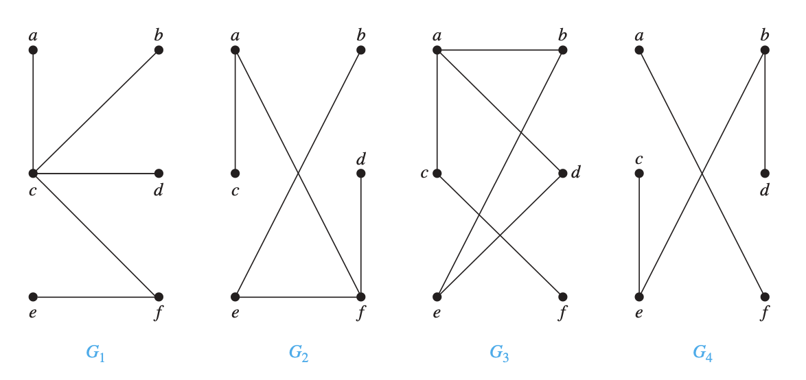
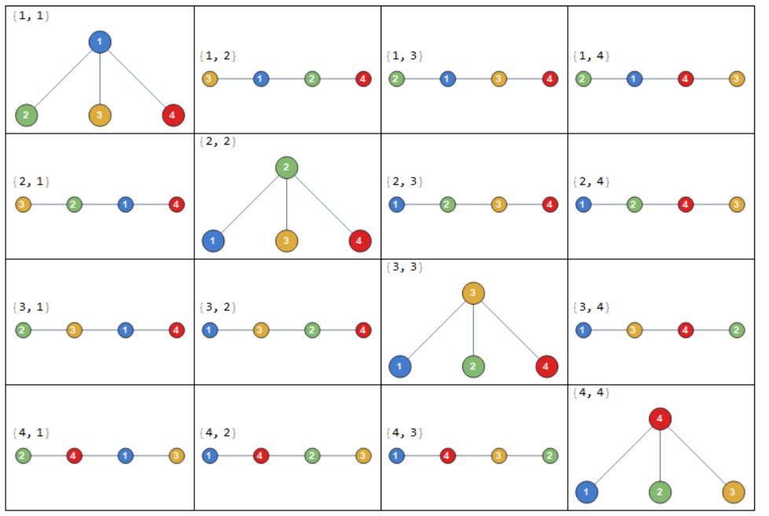
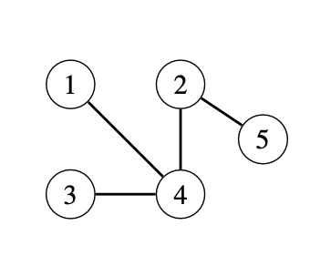
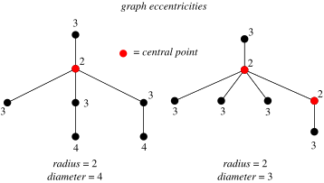

## Trees and Forests

A [**forest**](https://en.wikipedia.org/wiki/Tree_(graph_theory)#Forest) is an [acyclic](https://en.wikipedia.org/wiki/Cycle_(graph_theory)) [graph](https://en.wikipedia.org/wiki/Graph_(discrete_mathematics)). Any two [vertices](https://en.wikipedia.org/wiki/Vertex_(graph_theory)) in a forest are connected by at most one [path](https://en.wikipedia.org/wiki/Path_(graph_theory)).

A [**tree**](https://en.wikipedia.org/wiki/Tree_(graph_theory)) is a [connected](https://en.wikipedia.org/wiki/Connectivity_(graph_theory)#Connected_vertices_and_graphs) forest. In other words, all of a forest's [components](https://en.wikipedia.org/wiki/Component_(graph_theory)) are trees. Any two vertices in a tree are connected by exactly one path.

A forest with $n$ vertices and $e$ edges has $n-e$ components. A tree with $n$ nodes has $n-1$ edges. Removing any edge from a tree divides it into two components, and adding any edge creates a cycle.

The **leaves** of a tree are the nodes with only one neighbor.

_Question_: Which of the following graphs are trees?



### Verify a graph is a forest

Given an undirected graph, how do we know if the graph is a forest?

Using [DFS](https://en.wikipedia.org/wiki/Depth-first_search), the following function returns `True` if the input is acyclic.

```python
def is_forest(n: int, edges: list[list[int]]) -> bool:
    def has_cycle(root, parent):
        if seen[root]:
            return False
        seen[root] = True
        return any(
            (seen[nei] and nei != parent) or (not seen[nei] and has_cycle(nei, root))
            for nei in graph[root]
        )
    seen = [False] * n
    graph = [[] for _ in range(n)]
    for a, b in edges:
        graph[a].append(b)
        graph[b].append(a)
    return not any(has_cycle(i, -1) for i in range(n))
```

### Verify a graph is a tree

Given an undirected graph, how do we know if the graph is a tree?

A graph is a tree as long as it satisfies two out of the following three conditions:

1. the graph contains $n - 1$ edges
1. the graph does not contain cycles
1. the graph is connected

Condition 1 is straightforward to check, as long as we assume that `edges` are _distinct_.

The following function checks for conditions 1 and 2.

```python
def is_tree_check_acyclic(n: int, edges: list[list[int]]) -> bool:
    return len(edges) == n - 1 and is_forest(n, edges)
```

The following functions checks for conditions 1 and 3.

```python
def is_tree_check_connected(n: int, edges: list[list[int]]) -> bool:
    return len(edges) == n - 1 and _count_components(n, edges) == 1

def _count_components(n: int, edges: list[list[int]]) -> int:
    def visit(root):
        if not seen[root]:
            seen[root] = True
            for nei in graph[root]:
                visit(nei)
    seen = [False] * n
    graph = [[] for _ in range(n)]
    for a, b in edges:
        graph[a].append(b)
        graph[b].append(a)
    components = 0
    for v in range(n):
        if not seen[v]:
            visit(v)
            components += 1
    return components
```

### Cayley's Formula

[Cayley's formula](https://en.wikipedia.org/wiki/Cayley%27s_formula) states that there are $n^{n-2}$ labeled trees on $n$ nodes. The nodes are labeled $1, 2, \dots, n$, and two trees are different if either their structures or labelings are different.

For example, when $n=4$, the number of labeled trees is $4^{4-2} = 16$:



Next we will see how Cayley’s formula can be derived using Prüfer codes.

### Prüfer code

A [Prüfer code](https://en.wikipedia.org/wiki/Pr%C3%BCfer_sequence) is a sequence of $n − 2$ numbers that describes a labeled tree on $n$ nodes, and can be generated by a simple iterative algorithm.

#### Convert a tree into a Prüfer code

Consider a labeled tree $T$ with vertices $\{1, 2, ..., n\}$. At step $i$, remove the leaf with the smallest label and set the $i$th element of the Prüfer sequence to be the label of this leaf's neighbor.

For example, the Prüfer code of the tree below is $[4, 4, 2]$, because we remove leaves $1$, $3$, and $4$.



```python
from heapq import heapify, heappop, heappush

def prufer_code(edges: list[tuple[int, int]]) -> list[int]:
    n = len(edges) + 1
    graph: list[set[int]] = [set() for _ in range(n + 1)]
    for a, b in edges:
        graph[a].add(b)
        graph[b].add(a)
    pc = []
    leaves = [vertex for vertex in range(1, n + 1) if len(graph[vertex]) == 1]
    heapify(leaves)
    for _ in range(n - 2):
        leaf = heappop(leaves)
        neighbor = graph[leaf].pop()
        pc.append(neighbor)
        graph[neighbor].remove(leaf)
        if len(graph[neighbor]) == 1:
            heappush(leaves, neighbor)
    return pc
```

Let's see it in action:

```python
>>> tree = [(1, 4), (2, 5), (2, 4), (3, 4)]
>>> prufer_code(tree)
[4, 4, 2]
```

The above implementation runs in $O(n \log n)$ time.

Observe that each vertex appears in the Prüfer code a fixed number of times - its degree minus $1$, since the degree will get smaller every time we record its label in the code, and we remove it once the degree is $1$.

#### Convert a Prüfer code into a tree

Let ${a[0], a[1], ..., a[k-1]}$ be a Prüfer sequence of length $k$. The tree will have nodes labeled from $1$ to $k+2$. For each node set its degree to the number of times it appears in the sequence plus $1$. Next, for each number in the sequence $a[i]$, find the first (lowest-numbered) node, $j$, with degree equal to $1$, add the edge $(j, a[i])$ to the tree, and decrement the degrees of $j$ and $a[i]$. At the end of this loop two nodes with degree $1$ will remain (call them $u$ and $v$). Lastly, add the edge $(u,v)$ to the tree.

```python
def to_tree(pc: list[int]) -> list[tuple[int, int]]:
    n = len(pc) + 2
    edges = []
    degrees = [1] * (n + 1)
    for v in pc:
        degrees[v] += 1
    leaves = [v for v in range(1, n + 1) if degrees[v] == 1]
    for v in pc:
        i = heappop(leaves)
        edges.append((v, i))
        degrees[v] -= 1
        if degrees[v] == 1:
            heappush(leaves, v)
    edges.append((heappop(leaves), heappop(leaves)))
    return edges
```

#### Relation to Cayley's Formula

The immediate consequence is that Prüfer sequences provide a [bijection](https://en.wikipedia.org/wiki/Bijection) between the set of labeled trees on $n$ vertices and the set of sequences of length $n − 2$ on the labels $1$ to $n$. The latter set has size $n^{n−2}$, so the existence of this bijection proves Cayley's formula.

### Distance Measures

**eccentricity**: The eccentricity of a vertex $v$ is the maximum distance between $v$ and any other vertex in the tree.



The following function uses [DFS](https://en.wikipedia.org/wiki/Depth-first_search) to find the eccentricity of a `vertex` in a `graph` represented as an [adjacency list](https://en.wikipedia.org/wiki/Adjacency_list).

```python
def eccentricity_dfs(graph: list[list[int]], vertex: int) -> int:
    def dfs(root, parent):
        return 1 + max(
            (dfs(neighbor, root) for neighbor in graph[root] if neighbor != parent),
            default=-1,
        )

    return dfs(vertex, -1)
```

Below is the [BFS](https://en.wikipedia.org/wiki/Breadth-first_search) version:

```python
from collections import deque

def eccentricity_bfs(graph: list[list[int]], vertex: int) -> int:
    seen = [False] * len(graph)
    seen[vertex] = True
    dist = 0
    q = deque([vertex])
    while q:
        for _ in range(len(q)):
            node = q.popleft()
            for child in graph[node]:
                if not seen[child]:
                    seen[child] = True
                    q.append(child)
        dist += 1
    return dist - 1
```

Let's see it in action:

```python
graph = [[1], [0, 2, 3, 5], [1], [1, 4], [3], [1, 6], [5]]
assert eccentricity_bfs(graph, 0) == eccentricity_dfs(graph, 0) == 3
assert eccentricity_bfs(graph, 1) == eccentricity_dfs(graph, 1) == 2
assert eccentricity_bfs(graph, 2) == eccentricity_dfs(graph, 2) == 3
assert eccentricity_bfs(graph, 3) == eccentricity_dfs(graph, 3) == 3
assert eccentricity_bfs(graph, 4) == eccentricity_dfs(graph, 4) == 4
assert eccentricity_bfs(graph, 5) == eccentricity_dfs(graph, 5) == 3
assert eccentricity_bfs(graph, 6) == eccentricity_dfs(graph, 6) == 4
```

Let's also augment `eccentricity_bfs ` to also include the node that's furthest away from the input:

```python
from collections import deque

def eccentricity(graph: list[list[int]], vertex: int) -> tuple[int, int]:
    node = vertex
    q = deque([node])
    seen = [False] * len(graph)
    seen[node] = True
    dist = 0
    while q:
        for _ in range(len(q)):
            node = q.popleft()
            for child in graph[node]:
                if not seen[child]:
                    seen[child] = True
                    q.append(child)
        dist += 1
    return node, dist - 1
```

**diameter**: The maximum eccentricity of any vertex in the tree.

**peripheral vertex**: A vertex of maximum eccentricity.

**periphery**: The set of peripheral vertices.

To find the diameter of a tree, we first find the farthest node from an arbitrary node `a`, and name this node `b`. Then the diameter of the tree is the eccentricity of `b`.

```python
def get_diameter(tree: list[list[int]]) -> int:
    peripheral_node, _ = eccentricity(tree, 0)
    _, diameter = eccentricity(tree, peripheral_node)
    return diameter
```

**radius**: The minimum eccentricity of any vertex in the tree.

A tree's radius $r$ is related to its diameter $d$: $r = \lceil d / 2 \rceil$.

**central node**: A vertex of minimum eccentricity.

**center**: The set of central nodes.

_Theorem_: A tree can have either one or two central nodes. In the case of two central nodes, the two central nodes are adjacent.

**centered tree**: A tree with only one center.

**bicentered tree**: A tree with two centers.

```python
def find_center(n: int, edges: list[tuple[int, int]]) -> list[int]:
    if n <= 2:
        return list(range(n))

    graph: list[set[int]] = [set() for _ in range(n)]
    for a, b in edges:
        graph[a].add(b)
        graph[b].add(a)
    leaves = [v for v, neighbors in enumerate(graph) if len(neighbors) == 1]
    nodes_remaining = n
    while nodes_remaining > 2:
        new_leaves = []
        for leaf in leaves:
            nodes_remaining -= 1
            neighbor = graph[leaf].pop()
            graph[neighbor].remove(leaf)
            if len(graph[neighbor]) == 1:
                new_leaves.append(neighbor)
        leaves = new_leaves
    return leaves
```

[](https://ko-fi.com/T6T416OJAV)